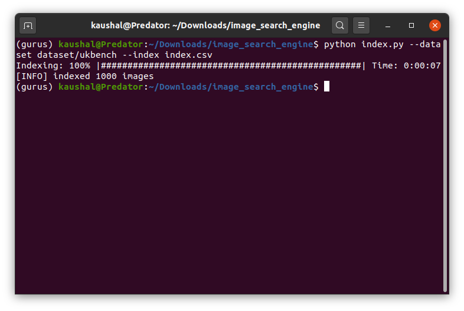
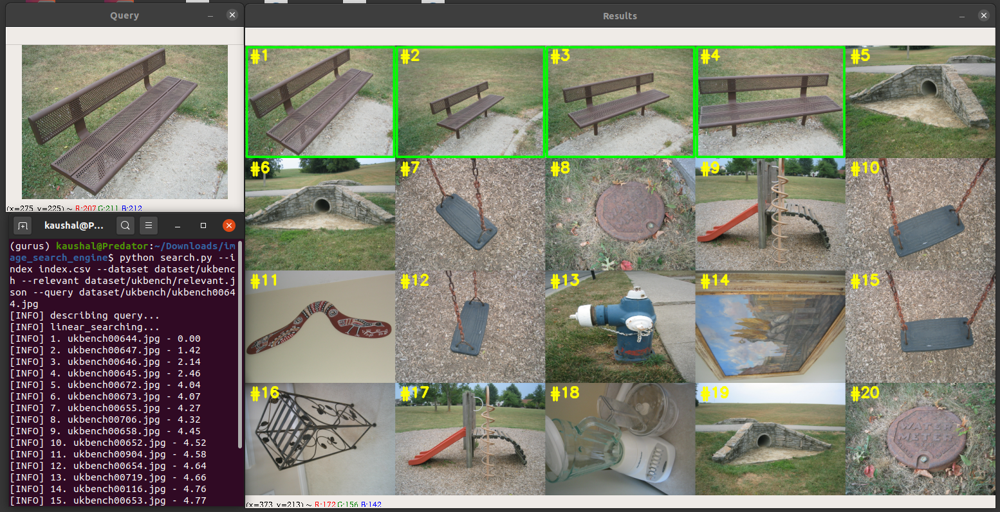
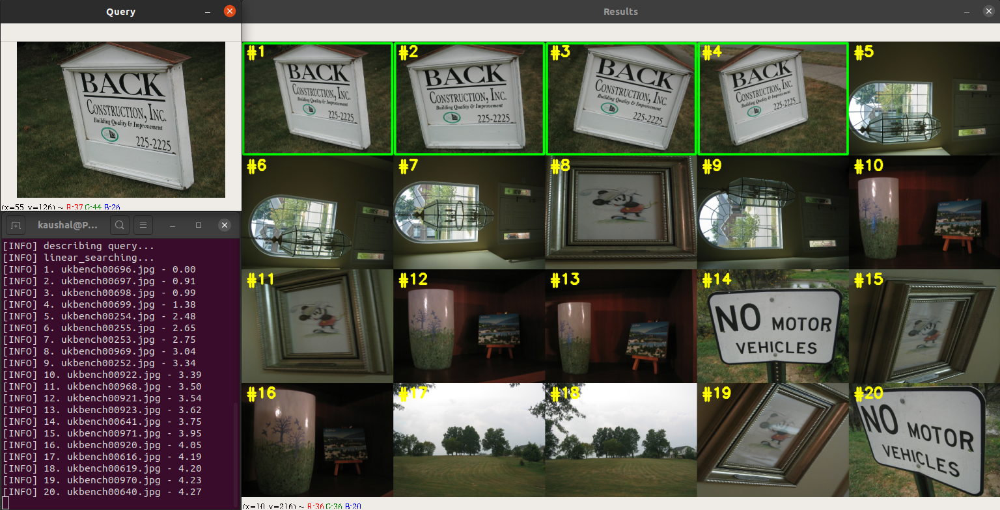

# Image Search Engine (BASIC)

I have build a very simple and basic Image Search Engine where I applied color histogram that can encode spatial information to describe the images.
After that, I have applied this image descriptor to a popular dataset and extract features from it. Following the procees, I have comstructed image search algorithms
to make collection of images visually searchable. The project is finished testing and exploring the results.

Intuitively, color histograms are not the best descriptors for image search engine but this project is focused on exploring algorithms and a overview of pipeline of an image search engine.
If you wish to do a deeper dive, **check out my more comprehensive and advanced project on image search engine** [here](https://github.com/Mister-kaushalam/image_search_engine)

## Goal of the project:

My goal here is to build a CBIR (content based image retrieval) model, commonly known as an image search engine. Given the dataset of photos, I want to make this
dataset "Searchable" by creating a "similar" like functionality. For example, If I put an image of a photo frame, the engine should be able to retrieve all images containing a photo frame.

## Features of this Project:
- Simple image search engine
- Use of color histogram as image discriptors
- Localization of image areas for more informative feature vector
- Extracting local histogram to capture and weigh outer points and center points differently

## The Data

[The UK Benchmark dataset](https://archive.org/details/ukbench), or simply UKBench for short,
is a dataset created by the Vision Group at the University of Kentucky and is used for the evaluation of CBIR systems.
We'll be using a sample of this dataset I have provided with the project folder. This sample contains 1000 images.

## Project overview
### Technical Information: 
In order to build this system, we’ll be using a simple, yet effective image descriptor: the color histogram.
By utilizing a color histogram as our image descriptor, we’ll be relying on the color distribution of the image. Because of this, we have to make an important assumption regarding our image search engine:

**Assumption:** Images that have similar color distributions will be considered relevant to each other. Even if images have dramatically different contents, they will still be considered “similar” provided that their color distributions are similar as well.

**Image Descriptor information:** I’ll be utilizing a **3D color histogram** in the **HSV color space** with **4 bins** for the Hue channel,
**6 bins** for the saturation channel, and **3 bins** for the value channel, yielding a total feature vector of dimension 4 x 6 x 3 = 72.

### File Specifications
Take a look inside the cbir module, you’ll find 
- a dists.py file which will contain our distance metric/similarity function used to compare two images for similarity. 
- The *hsvdescriptor*  will implement our color descriptor used to extract feature vectors from our images.
- The *resultsmontage*  contains a utility class that is used to display the results of a search to our screen. 
- The *searcher* encapsulate our Searcher class used to perform an actual search.
- Finally, we have two driver files,  *index.py* , which is used to extract features from our UKBench dataset, followed by *search.py* , which will accept a query image, call the *Searcher* , and then display the results to our screen.

## Requirements:
```
pip install numpy
pip install imutils
pip install progressbar 
```
I'll be using **OpenCV 4** for this project and I would recommend to follow this amazing guide to [install OpenCV 4](https://www.pyimagesearch.com/2018/08/15/how-to-install-opencv-4-on-ubuntu/)
. Don't forget to turn on the OPENCV_ENABLE_NONFREE flag while installing. The guide which I have linked have the instructions to do that.

## Runing the code

1. Start the feature extraction process. You can skip this, as I have already attached the output file to this project.
```
python index.py --dataset dataset/ukbench --index index.csv
```
When the script finishes, you’ll see you have a new file named index.csv in your current working directory.


2. Image search engine in Action
```
python search.py --index index.csv --dataset dataset/ukbench --relevant dataset/ukbench/relevant.json	--query dataset/ukbench/ukbench00644.jpg
  ```





# Author: Kaushal Bhavsar
